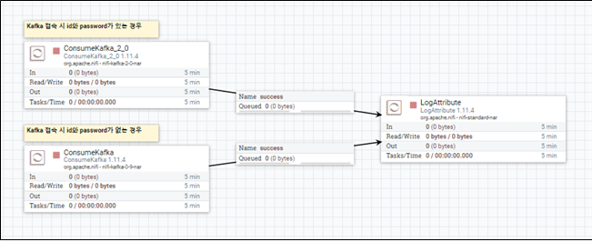
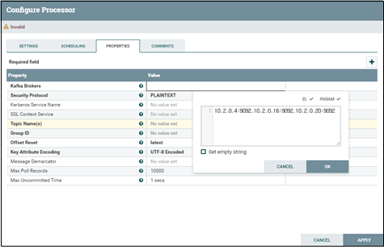
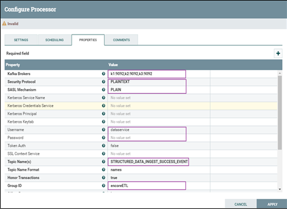
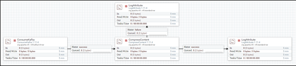
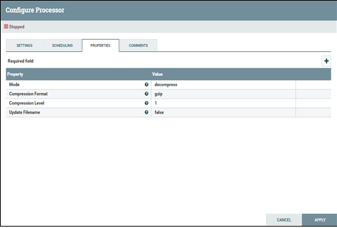
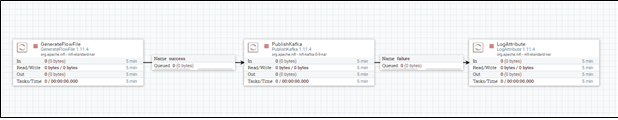
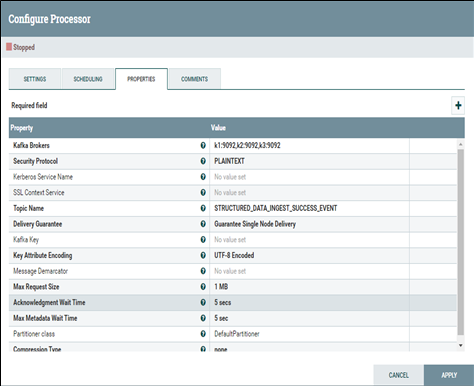
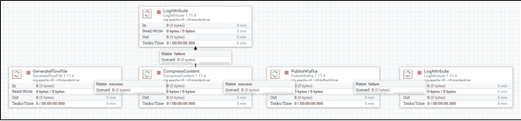
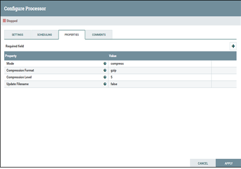

# KAFKA 관련 템플릿
## Kafka Consume (SmartCity_NiFi_Template-01)
* Kafka로부터 message를 가져오는(consume) 템플릿

### id와 password가 없는 경우
* Kafka Brokers list를 설정
* Kafka Topic 설정
* Group ID 설정
* Offset Reset latest로 설정

### id와 password가 있는 경우
* Kafka Brokers를 설정
* Security 관련 설정
* Kafka Topic 설정
* Group ID 설정
* Offset Reset latest로 설정

## Kafka Consume compressed message (SmartCity_NiFi_Template-02)
* Kafka로부터 압축된 message를 가져오는 템플릿.
* Kafka로부터 메시지를 consume해서 message의 압축을 해제하고 사용.

### 압축 해제에 관한 설정
* Mode는 decompress
* Compression Format과 level은 압축 알고리즘에 맞게 설정

## Kafka Publish (SmartCity_NiFi_Template-03)
* Message를 Kafka에 publish하는 템플릿.

### Kafka publish 설정
* Kafka Brokers list 설정
* Topic Name 설정
* Delivery Guarantee는 Guarantee Single Node Delivery로 설정 (ack = 1)

## Kafka Publish (SmartCity_NiFi_Template-04)
* Message를 압축하여 Kafka에 publish하는 템플릿.

### 압축 설정
* 압축 알고리즘과 level 설정

