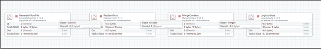
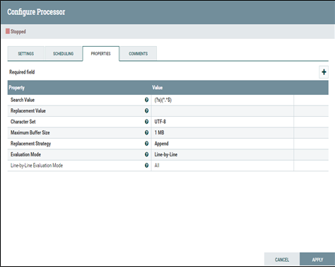
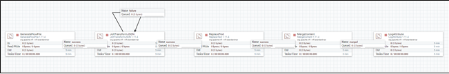
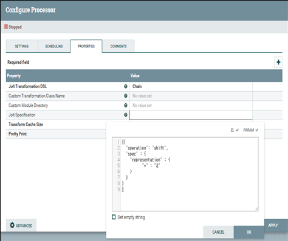
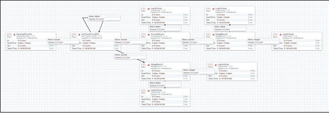
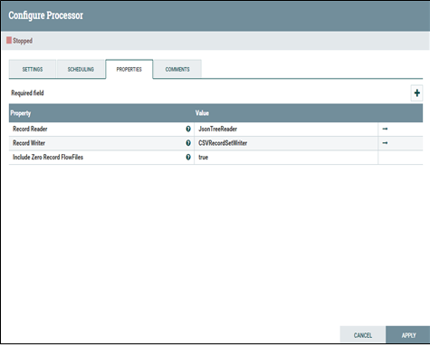
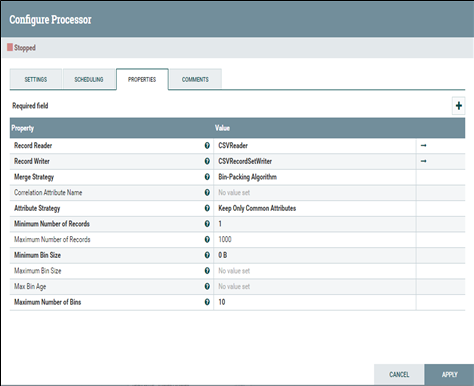

# Merge Contents 관련 템플릿
## JSON format file merge (SmartCity_NiFi_Template-12)
* JSON file을 merge하기 위해 사용
<pre><code>
{JSON file}
{JSON file}
...
{JSON file}
</code></pre>
* JSON file과 JSON file은 new line으로 구분하여 적재

### ReplaceText, MergeContent processor 사용
* Search Value는 (?s)(^.*$) 설정
* Replacement Value는 new line으로 설정

## JSON transformation and file merge (SmartCity_NiFi_Template-13)
* JSON file의 특정 부분만 추출하여 그 내용만을 merge

### JoltTransformJSON, ReplaceText, MergeContent processor 사용
* Jolt Specification 설정

## Convert JSON to CSV format and file merge (SmartCity_NiFi_Template-14)
* JSON file에서 저장하고자 하는 해당 내용만을 추출하여, record형태로 만들고, 이 record의  형식을 CSV 형태로 변환 후 merge record processor를 사용하여 record를 merge
* JSON file에서 저장하고자 하는 해당 내용만을 추출하여 convert record를 거치지 않고, 바로 merge record processor를 이용하여 record를 merge

### JoltTransformJSON, ConvertRecord, MergeRecord processor 사용
* Record Reader와 Record Writer를 설정
* Record Reader는 JsonTreeReader, Record Writer는 CSVRecordSetWriter로 설정

* Record Reader와 Record Writer를 설정
* Record Reader는 CSVReader, Record Writer는 CSVRecordSetWriter로 설정

