# HDFS 관련 템플릿
## HDFS file read (SmartCity_NiFi_Template-15)
* EvaluateJsonPath, RouteOnAttribute processor 사용

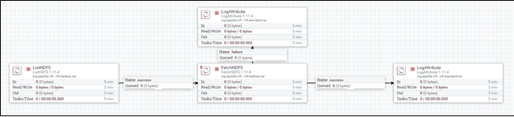

### ListHDFS, FetchHDFS processor 사용
* Hadoop Configuration Resources 설정
* Directory 설정
* File Filter를 사용할 수 있음.

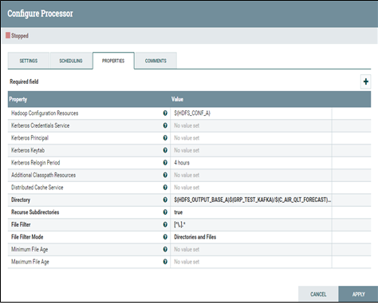

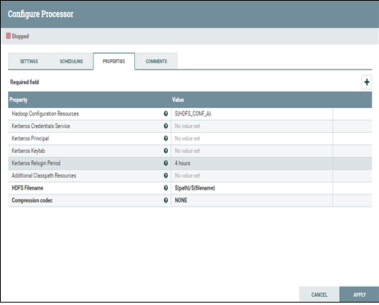

## HDFS file write (SmartCity_NiFi_Template-16)
* 해당 내용을 HDFS에 저장하기 위해 사용

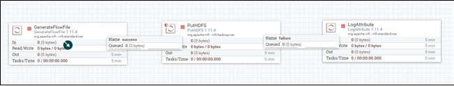

### PutHDFS processor 사용
* Hadoop Configuration Resources 설정
* Directory 설정

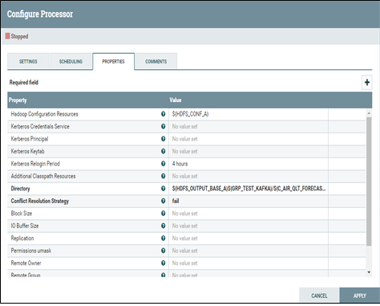

## HDFS file read + Scheduling (SmartCity_NiFi_Template-17)
* 지정된 시간에 해당 HDFS 디렉토리의 file을 read

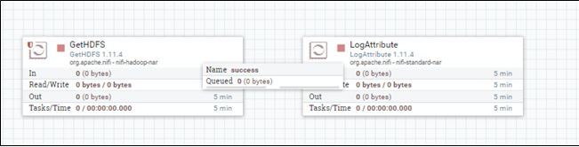

### GetHDFS 사용
* Hadoop Configuration Resources를 설정
* Directory 설정
* Keep Source File을 설정 (read 후 file을 보존하려면 true로 설정해야 file이 지워지지 않음, default : false)

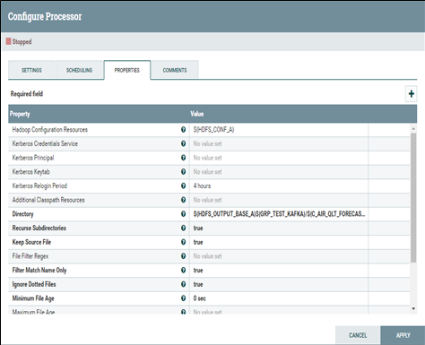

* SCHEDULING에서 Scheduling Strategy설정 (Timer Driven, CRON Driven)
* 8 hours 마다 실행 시 (Scheduling Strategy : CRON Driven, Run Schedule : * * */8 * * ?)

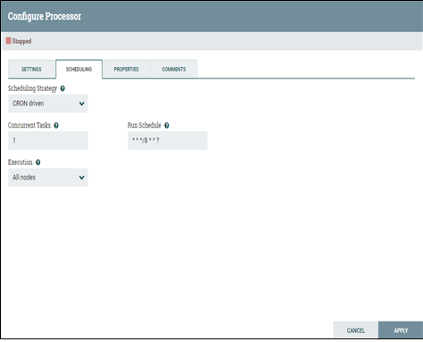

## HDFS file read parquet file format (SmartCity_NiFi_Template-18)
* HDFS의 특정 directory에서 parquet file read시 사용

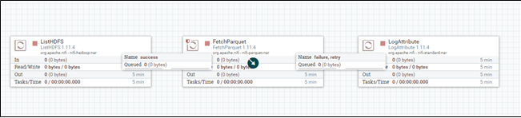

### ListHDFS, FetchParquet processor 사용
* Hadoop Configuration Resources를 설정
* Directory 설정
* Record Write JSONRecordSetWrite ( parquet file은 해당 파일의 footer에 schema가 존재함, 이를 read하여 parquet file의 내용을 읽어 들일 수 있고, Record Writer를 통하여 사용하고자 하는 record의 format을 설정하여 변환하여 사용할 수 있음)

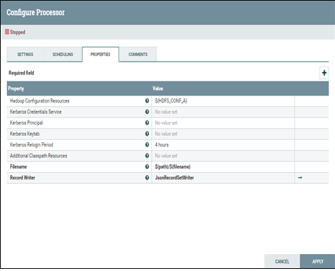

## HDFS file write parquet file format (SmartCity_NiFi_Template-19)
* 저장하고자 하는 내용을 record로 변환하여 HDFS에 parquet file로 저장

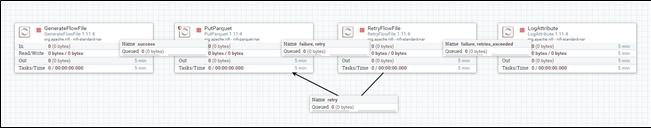

### PutParquet processor 사용
* Hadoop Configuration Resources를 설정
* Directory 설정
* Record Reader 설정 (해당 내용이 JSON format이어 JsonTreeReader 사용)
* Compression Type 설정( snappy로 설정)

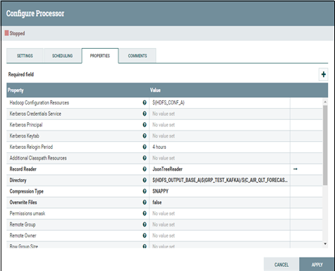

## HDFS file write fail 시 retry (SmartCity_NiFi_Template-20)
* HDFS에 파일을 저장시 Error가 발생했을 시 retry를 통해 재 시도하여 HDFS에 file을 write

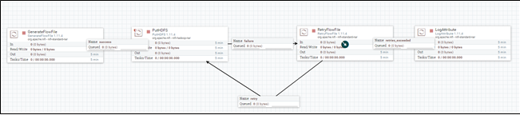

### PutHDFS, RetryFlowFile processor 사용
* Hadoop Configuration Resources를 설정
* Directory 설정

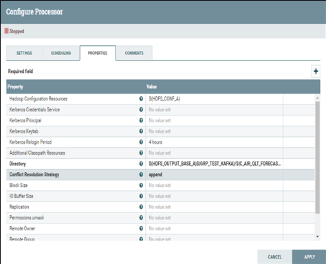

* Maximum Retries 설정( 3회 재 시도)

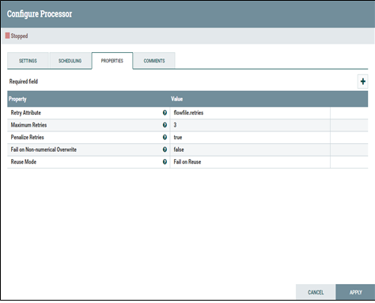