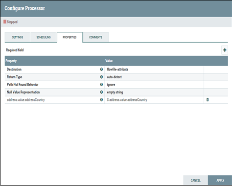

# JSON file handling 관련 템플릿
## JSON file에서 특정 key의 value 추출 (SmartCity_NiFi_Template-05)
* JSON file에서 특정 key의 value 추출

###  EvaluateJsonPath processor 사용
* Destination을 flowfile-content로 설정
* "+"를 선택하여 해당 key의 value를 얻기위한 설정을 추가

## JSON file에서 특정 key의 value를 추출하여 attribute에 추가(SmartCity_NiFi_Template-06)
* JSON file에서 특정 key의 value를 추출하여 flow-file의 attribute에 추가하여 사용

###  EEvaluateJsonPath processor 사용
* Destination을 flowfile-attribute로 설정(value만을 추출하기 위해서는 flowfile-content를 사용하지만, attribute에 추가하기 위해서는 destination을 flowfile-attribute로 설정)
* "+"를 선택하여 해당 key의 value를 추출하기 위한 설정을 추가

