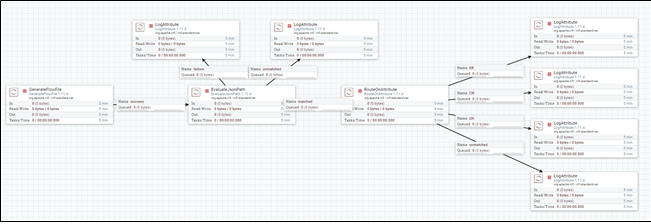
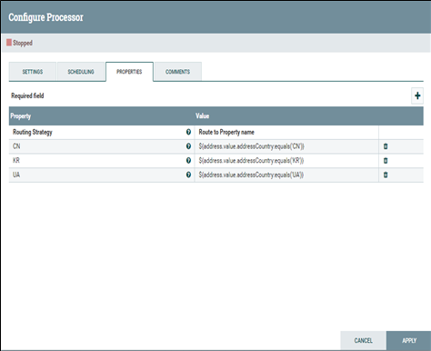
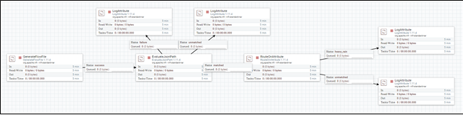

# Routing 관련 템플릿
## 조건에 의한 routing (SmartCity_NiFi_Template-07)
* JSON file에서 특정 key의 value를 추출하여 flow-file의 attribute에 추가하고 이를 기준으로 routing하는 템플릿

###  EvaluateJsonPath, RouteOnAttribute processor 사용
* "+"를 선택하여 해당 routing 조건 설정을 추가
* routing 조건에 의한 분기 설정

## 그룹조건(조건1+조건2)에 의한 routing (SmartCity_NiFi_Template-08)
* 여러 조건을 가진 routing

###  EvaluateJsonPath, RouteOnAttribute processor 사용
* "+"를 선택하여 해당 routing 조건 설정을 추가
* 비가 오면서 강수량이 50이상일 경우 heavy rain 조건 추가

