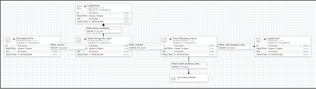
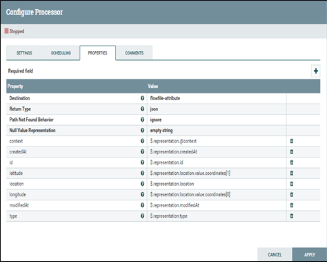
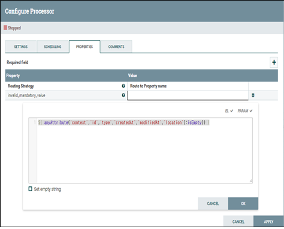
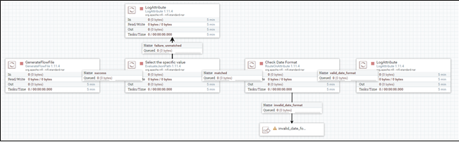
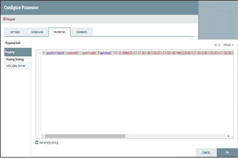
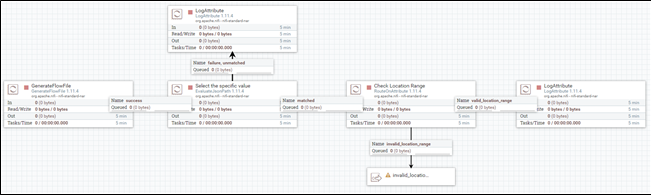
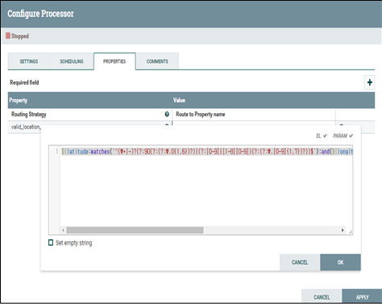

# Filtering 관련 템플릿
## JSON format file의 key가 존재하지 않을 경우 (SmartCity_NiFi_Template-09)
* JSON file의 경우 key가 존재하지 않아 value가 empty인 경우를 filtering하기 위해 사용

### EvaluateJsonPath, RouteOnAttribute processor 사용
* "+"를 선택하여 해당 routing 조건 설정을 추가

* 데이터의 필수 항목인 ‘context’, ‘id’, ‘type’, ‘createdAt’, ‘modifiedAt’, ‘location’ 정보 중 1개라도 value가 없으면 필수 항목이 없는 조건으로 설정하여 filtering하여 message의 예외 처리

## Value의 format이 조건에 부합하지 않을 경우 (SmartCity_NiFi_Template-10)

### EvaluateJsonPath, RouteOnAttribute processor 사용
* "+"를 선택하여 해당 routing 조건 설정을 추가
* date time의 format 및 유효성을 검사하기 위한 filtering 조건 추가 
* regular expression을 사용하여 작성

## Value의 range 조건이 부합하지 않을 경우 (SmartCity_NiFi_Template-11)
* 위도와 경도의 범위를 벗어난 조건들을 filtering하기 위해 사용

### EvaluateJsonPath, RouteOnAttribute processor 사용
* "+"를 선택하여 해당 routing 조건 설정을 추가
* regular expression 정의를 통하여 filtering

