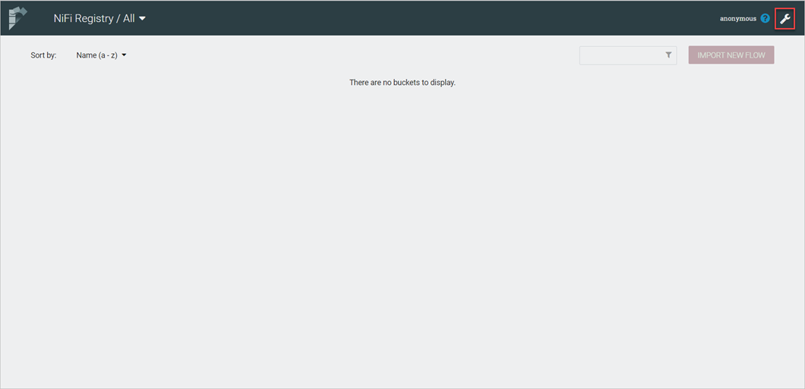
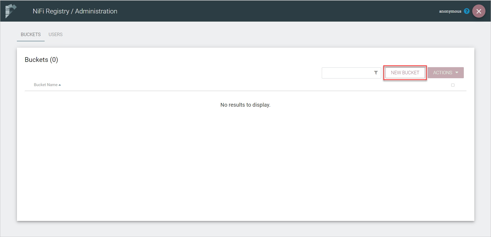
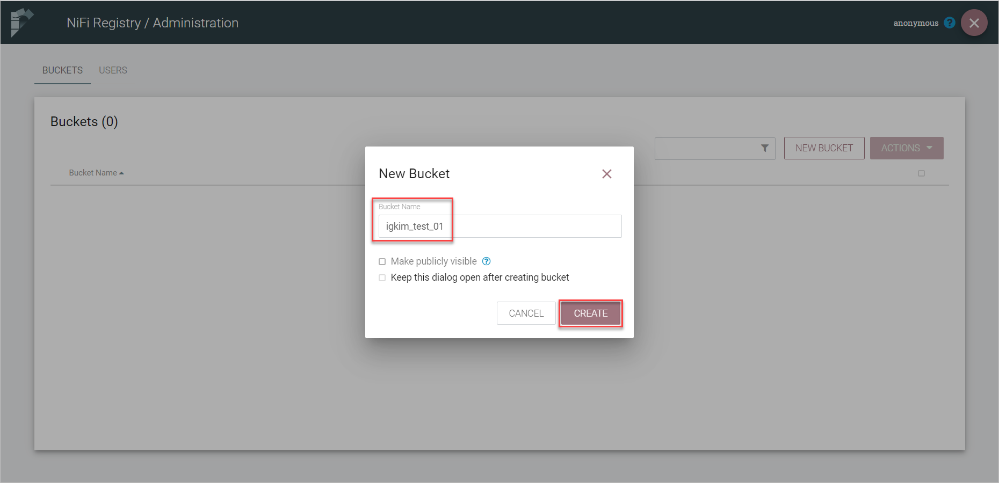
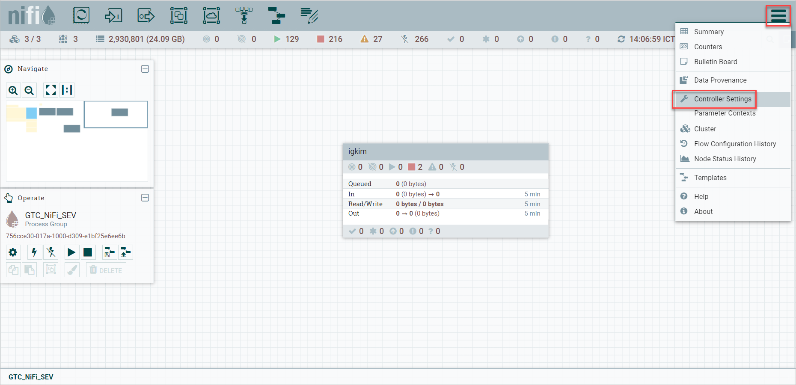
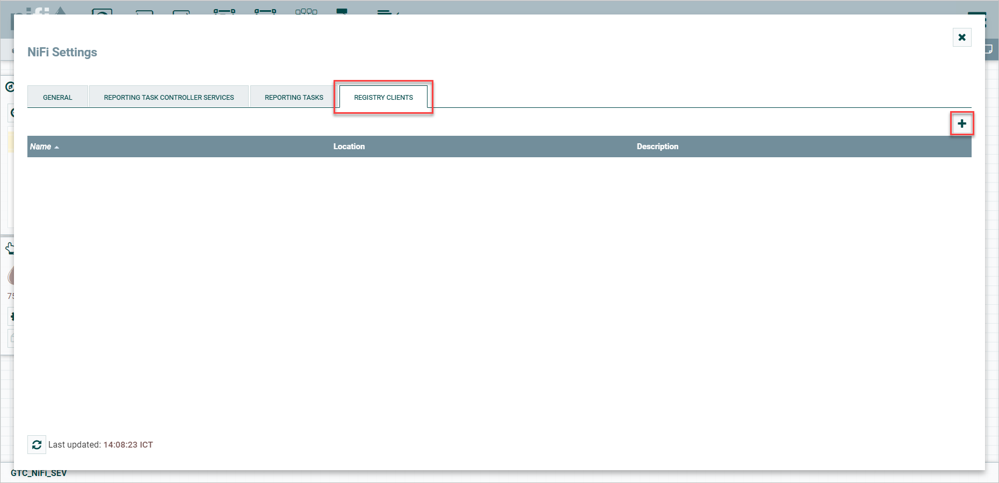
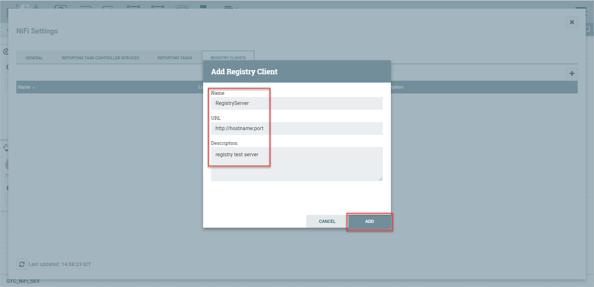
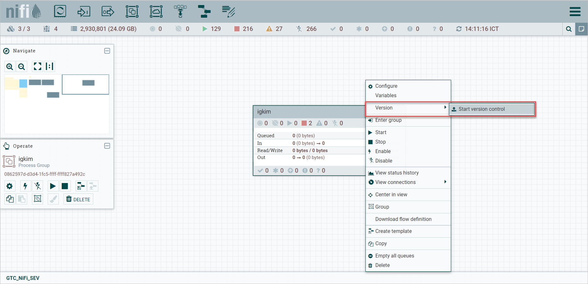
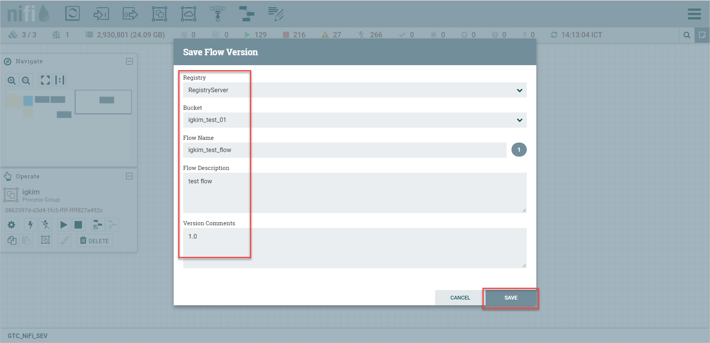
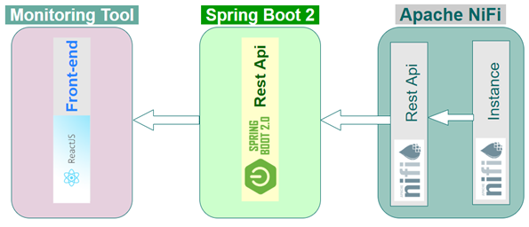
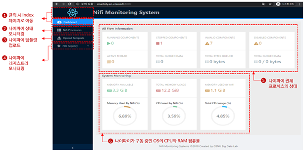

## 데이터레이크 ETL 매니저
### NiFi 설치 및 실행
1. NiFi 요구사항
    * download nifi binary file : nifi-1.14.0-bin.tar.gz
    * NiFi 구동을 위해 java 1.8이상이 필요하다.
    * 서비스를 위해 8080(변경 가능) 포트 개방이 필요하다.
2. 설치 
    * CentOS 7.5 기준
    * bigdata:bigdata 계정:그룹으로 구동하고 bigdata 계정의 home 디렉토리에 설치 하는 것으로 가정한다.
        * 바이너리 첨부된 파일을 사용하거나 공식 홈페이지에서 다운로드 한다.
        * https://nifi.apache.org/ - [Download] - Release 메뉴에서 다운로드 할 수 있다.
        * 예시) wget https://archive.apache.org/dist/nifi/1.14.0/nifi-1.14.0-bin.tar.gz 
    * 압축 해제
        >바이너리 파일이 다운로드 된 곳에서
   tar -xvzf nifi-1.14.0-bin.tar.gz 
3. 실행
    * 압축이 해제된 디렉토리로 이동한다.
        >cd ~/nifi-1.14.0
    * 서비스를 시작한다.
        >bin/nifi.sh start
4. 종료 및 재시작
    * 종료
        >bin/nifi.sh stop
    * 재시작
        >bin/nifid.sh restart 

### NiFi registry 설치 및 실행 
1. NiFi registry 요구사항
    * NiFi 구동을 위해 java 1.8이상이 필요하다.
    * 서비스를 위해 18080(변경 가능) 포트 개방이 필요하다.
2. 설치
    * CentOS7.5 기준
    * bigdata:bigdata 계정:그룹으로 구동하고 bigdata 계정의 home 디렉토리에 설치 하는 것으로 가정한다.
    * Repository로 사용할 DBMS가 필요하다. MySQL,PostgresQL 등을 지원한다.
    * 데이터베이스 계정 생성 및 DB 생성, 권한 설정이 완료 돼있어야 한다.
    * DBMS 연결을 위한 JDBC 드라이버 파일을 '압축이 해제된 디렉토리'/lib 디렉토리에 복사
        * 바이너리 첨부된 파일을 사용하거나 공식 홈페이지에서 다운로드 한다.
        * https://nifi.apache.org/ - [Subproject] - [Registry] - Links 메뉴에서 다운로드 할 수 있다.
            >wget https://mirror.navercorp.com/apache/nifi/1.14.0/nifi-registry-1.14.0-bin.tar.gz
        * 압축 해제
            >(바이너리 파일이 다운로드 된 곳에서) tar -xvzf nifi-registry-1.14.0-bin.tar.gz

3. 실행
    * 압축이 해제된 디렉토리로 이동한다.
        >cd ~/nifi-registry-1.14.0
    * 서비스를 시작한다.
        >bin/nifi-registry.sh start

4. 종료 및 재시작
    * 종료
        >bin/nifi-registry.sh stop
    * 재시작
        >bin/nifi-registry.sh restart
### 설정
#### 기본설정(nifi-env.sh)
1. NiFi home directory 정의 
    * 별도 설정이 없을 경우 binary가 압축해제된 디렉토리가 NIFI_HOME으로 지정된다.
        * 수정을 원할 경우
            >'압축이 해제된 디렉토리'/bin/nifi-env.sh 파일의 42번째 줄을 수정한다. 
        * 기본값

            ````NIFI_HOME="$(setOrDefault "$NIFI_HOME" "$(cd "$SCRIPT_DIR" && cd .. && pwd)")"````
    
            >NIFI_HOME=/home/bigdata/nifi
  
2. PID 파일 저장 경로 정의
    * '압축이 해제된 디렉토리'/bin/nifi-env.sh 파일의 46번째 줄을 수정한다. 
3. log 파일 저장 경로 정의
    * '압축이 해제된 디렉토리'/bin/nifi-env.sh 파일의 50번째 줄을 수정한다. 

4. JAVA HOME 설정
    * JDK 혹은 JRE 설정을 참조하여 설정한다.
        * '압축이 해제된 디렉토리'/bin/nifi-env.sh 파일의 26번째 줄을 수정한다.
        * 예시) export JAVA_HOME=/home/java/jdk1.8.0
#### NiFi설정(bootstrap.conf)
1. NiFi 어플리케이션 구동 설정
    * 처리하는 데이터가 많을 경우 
        * nifi가 구동되는 서버의 사양을 감안하여 수정한다.
            * '압축이 해제된 디렉토리/'conf/bootstrap.conf 파일의 38,39번째 줄을 수정한다.
            * java heap 과관련된 설정으로써 최소 값과 최대 값을 적당히 가감한다.
  
2. 그 외 구동 옵션과 관련한 java 옵션 수정
    * '압축이 해제된 디렉토리/'conf/bootstrap.conf 파일의 끝에 추가 한다.
        * java.arg.18='추가하고자 하는 옵션'
        * 옵션을 더 추가하는 경우 변수 번호를 1씩 증가하면서 추가한다.

3. nifi.properties
    * NiFi 설정 및 튜닝 관련 설정 정의
        * 서비스(UI 접속)를 위한 설정
            * '압축이 해제된 디렉토리/'conf/nifi.properties 파일의 153,154번째 줄을 수정한다.
                * nifi.web.http.host='nifi가 구동되는 서버의 호스트명 또는 IP'
                * nifi.web.http.port='사용하고자 하는 포트'

>그 외 설정은 nifi.properties.ref 파일의 주석을 참고하여 수정한다.
#### NiFi registry설정(nifi-registry.properties)
1. 서비스(UI 접속)를 위한 설정
    * '압축이 해제된 디렉토리/'conf/nifi.properties 파일의 18,19번째 줄을 수정한다.
        >nifi.registry.web.http.host='nifi-registry가 구동되는 서버의 호스트명 또는 IP'

        >nifi.registry.web.http.port='사용하고자 하는 포트'
  
2. Repository DBMS 설정
    * '압축이 해제된 디렉토리/'conf/nifi.properties 파일의 58~62번째 줄을 수정한다.
        >nifi.registry.db.url=jdbc:mysql://{FQDN}:{Port}

        >nifi.registry.db.driver.class=org.mariadb.jdbc.Driver

        >nifi.registry.db.driver.directory=/home/manager/apache/registry/lib

        >nifi.registry.db.username={DB id}

        >nifi.registry.db.password={DB pw}
  
#### NiFi - NiFi-registry 연동
1. Bucket 생성
    1. NiFi-Registry 웹 접속 후 우측 상단의 스패너 아이콘 선택
        <p align="center">
            
        </p>    
    2. [New Bucket] 선택
        <p align="center">
            
        </p>    
    3. Bucket Name 입력
        <p align="center">
            
        </p>    
 
2. NiFi 설정
   1. NiFi 웹 접속 후 우측 상단의 메뉴 아이콘 선택 후 [Controller Settings] 선택
        <p align="center">
            
        </p>    
   2. [Registry Clients] 선택
        <p align="center">
            
        </p>    
   3. NiFi-Registry 서버의 이름, URL, 설명 입력
        <p align="center">
            
        </p>    
 
3. Flow version control 설정
   1. 버전 관리 대상 프로세스 또는 프로세스 그룹 선택 후 마우스 오른쪽 버튼 클릭, [Verwion]-[Start version control] 선택
        <p align="center">
            
        </p>    
   2. 버전 관리 대상 NiFi-Registry와 Bucket 선택 후 Flow Name 입력
        <p align="center">
            
        </p>    

### ETL 모니터링 도구 시스템

### 시스템 개요
* 데이터레이크 ETL 작업을 실행하는 Apache NiFi의 웹 모니터링 도구이다.
* Front-End 파트는 자바스크립트 기반의 React.JS 프레임워크를 사용했으며, 스프링부트를 Back-End 파트로 사용하여 나이파이에서 제공되는 Rest API를 호출하여 구동 중인 나이파이의 작업을 모니터링한다.
    <p align="center">
        
    </p>

### ETL 모니터링 도구 Front-End
1. requirements
    * NodeJS 설치(최신버전 권장)
    * NPM or YARN 설치(최신버전 권장)
    * Nginx 설치

2. 환경설정 수정 및 배포 스크립트 실행
    1. 디렉토리 파일 구성
        * config : 리액트 프레임워크 설정 디렉토리
        * .env : 나이파이 설정 파일
        * nginx-nifi-monitor-app-config.conf : nginx와 리액트 프레임워크를 연결하는 설정파일
        * package.json, package-lock.json, yarn.lock : 리액트 프레임워크 의존성 관리 파일
        * public : 리액트 관련 프레임워크
        * react-deploy.sh : 전체 실행 명령어가 담긴 배포 스크립트 파일
        * scripts, src : 리액트 프레임워크 소스코드 파일

    2. .env 파일 설정
        >vi .env
        * API_URL : 모니터링 서비스에서 사용하는 Back-End 서비스 API의 URL
        * API_PORT : API의 포트번호, 반드시 콜론(:)으로 시작해야 함
        * NIFI_INSTANCE_URL : 모니터링 대상 나이파이의 URL
        * NIFI_INSTANCE_PORT : 모니터링 대상 나이파이의 실행 포트번호, 반드시 콜론(:)으로 시작해야 함
    
    3. nginx 파일 설정
        ```
        server {
            listen       8001;
            server_name  localhost;

            #charset koi8-r;
            #access_log  /var/log/nginx/host.access.log  main;

            location / {
                root   /usr/share/nginx/html/nifi-react-dashboard-hierarchy-view;
                index  index.html index.htm;
                try_files $uri $uri/ /index.html;
                expires -1;
            }

            #error_page  404              /404.html;

            # redirect server error pages to the static page /50x.html
            #
            error_page   500 502 503 504  /50x.html;
            location = /50x.html {
                root   /usr/share/nginx/html;
            }

            # proxy the PHP scripts to Apache listening on 127.0.0.1:80
            #
            #location ~ \.php$ {
            #    proxy_pass   http://127.0.0.1;
            #}

            # pass the PHP scripts to FastCGI server listening on 127.0.0.1:9000
            #
            #location ~ \.php$ {
            #    root           html;
            #    fastcgi_pass   127.0.0.1:9000;
            #    fastcgi_index  index.php;
            #    fastcgi_param  SCRIPT_FILENAME  /scripts$fastcgi_script_name;
            #    include        fastcgi_params;
            #}

            # deny access to .htaccess files, if Apache's document root
            # concurs with nginx's one
            #
            #location ~ /\.ht {
            #    deny  all;
            #}
        ```
        * Front-End의 실행 포트를 변경하고 싶을경우 “listen 8001”에서 원하는 포트번호로 변경

    4. 배포 스크립트 파일
        ```
        #!/bin/bash
        # shellcheck disable=SC2034
        ROOT_DIR=/usr/share/nginx/html
        APP_DIR=nifi-react-dashboard-hierarchy-view
        NGINX_FILE=nginx-nifi-monitor-app-config.conf
        echo "> Starting..."
        chmod +x ./env.sh && ./env.sh && cp env-config.js ./public/
        if [ -d "build" ]
        then
                rm -rf build/
        fi
        echo "> Installing the dependencies"
        npm install
        sleep 2
        echo "> Building the project"
        yarn build
        sleep 2
        if [ -d $ROOT_DIR/$APP_DIR ]
        then
            echo "Directory $ROOT_DIR/$APP_DIR"
            sudo rm -rf $ROOT_DIR/$APP_DIR/*
        else
            echo "Creating Directory $APP_DIR"
            sudo mkdir $ROOT_DIR/$APP_DIR
        fi
        sudo cp -r build/* $ROOT_DIR/$APP_DIR/
        #NGINX Version 1.17.7
        sudo cp $NGINX_FILE /etc/nginx/conf.d/
        echo "> Restarting NGINX Server"
        sudo systemctl restart nginx
        sleep 1
        echo ">>> DONE!"
        ```
        * 설정파일과 소스파일을 빌드한 뒤 실행하는 과정
        * env.sh 파일 및 nginx까지 자동으로 실행
        * ROOT_DIR : nginx와 연동을 위해 지정된 디렉토리
        * APP_DIR : nginx-scity-react-app-config.conf 파일의 location { root 의 /usr/share/nginx/html/{scity-dlm-reactjs}; } 값의 {scity-dlm-reactjs}와 동일
        * NGINX_FILE : 배포 디렉토리 내의 nginx 설정파일인 nginx-scity-react-app-config.conf의 이름과 동일
        * 나이파이정보 변경 후 실행 시 .env 파일 변경 후 react-deploy.sh 파일 실행
        * 실행 명령어
            >./react-deploy.sh

### ETL 모니터링 도구 Back-End
1. requirements
    * JDK 8 버전 이상 설치
    * 9990 포트 사용 가능
    * Apache Maven 3.3.1 이상 설치

2. 환경설정 수정 및 배포 스크립트 실행
    1. 디렉토리 파일 구성
        * configprops.json : 나이파이 관련 ip, 포트 등을 설정하는 파일
        * deploy.sh : 전체 실행 명령어가 담긴 배포 스크립트 파일
        * logs : 로그파일을 포함하는 디렉토리
        * nifi-monitor-spring-boot.jar : 소스파일을 패키징한 실행 파일
        * nifi_process_id.txt : 현재 서버에서 실행되는 나이파이의 프로세스 id를 저장하는 파일
        * src : 나이파이 모니터링 Back-End 소스코드
        * target : 나이파이 모니터링 Back-End 실행 관련 패키지 파일

    2. NiFi 연동 설정
        >vi configprops.json
        * config.nifiRootFlowId : 모니터링 대상 나이파이의 최상위 프로세스 그룹 ID
        * config.nifiPort : 모니터링 대상 나이파이의 포트
        * config.runningOS : 모니터링 백엔드 서비스가 작동할 OS(MacOS, WindowsOS, CentOS, Ubuntu)
        * config.nifiURL : 모니터링 대상 나이파이 URL(포트 포함)
        * config.nifiRegistryURL : 모니터링 대상 나이파이 레지스트리 URL(포트 포함)


    3. 배포 스크립트 파일
        ```
        #!/bin/bash

        dt=$(date '+%Y%m%d')
        dd=$(date '+%d')
        yymm=$(date '+%Y%m')

        REPOSITORY=/home/cbnu/deploy/monitoring
        PROJECT_NAME=nifi-monitoring-spring-boot
        SERVICE_NAME=nifi-monitor-spring-boot


        cd $REPOSITORY/$PROJECT_NAME/
        echo "> Start Buiding the Project"
        mvn clean install

        echo "> crud 디렉토리로 이동"

        cd $REPOSITORY/$PROJECT_NAME

        echo "> Build 파일 복사"

        cp $REPOSITORY/$PROJECT_NAME/target/*.jar $REPOSITORY/$PROJECT_NAME/
        cp $REPOSITORY/$PROJECT_NAME/configprops.json $REPOSITORY/$PROJECT_NAME/

        echo "> 현재 구동중인 애플리케이션 pid 확인"

        CURRENT_PID=$(pgrep -f ${SERVICE_NAME}*.jar)

        echo "> 현재 구동중인 애플리케이션 pid: $CURRENT_PID"

        if [ -z "$CURRENT_PID" ]; then
        echo "> 현재 구동 중인 애플리케이션이 없으므로 종료하지 않습니다."
        else
        echo "> kill -15 $CURRENT_PID"
        kill -15 $CURRENT_PID
        sleep 5
        fi

        echo "> 새 애플리케이션 배포"

        JAR_NAME=$(ls -tr $REPOSITORY/$PROJECT_NAME | grep *.jar | tail –n 1)
        echo "> JAR Name: $JAR_NAME"

        echo "> Absolute Path: $REPOSITORY/$PROJECT_NAME"

        nohup java -jar -Dapp.config_file_path=$REPOSITORY/$PROJECT_NAME $REPOSITORY/$PROJECT_NAME/"$JAR_NAME" > $REPOSITORY/$PROJECT_NAME/logs/${dt}_${PROJECT_NAME}.log 2>&1 &
        ```
        * 소스파일을 Maven을 이용하여 빌드한 뒤 실행하는 과정
        * 프로세스가 실행 중이면 프로세스를 종료한 뒤 실행
        * 로그파일은 logs 디렉토리에 실행한 “날짜_nifi-monitoring-spring-boot.log” 이름으로 생성
        * 다시 배포 스크립트 파일이 실행될 때까지 생성된 로그파일에 로그가 기록되며, 배포스크립트 파일을 다시 실행할 시 새로운 로그파일이 생성됨
        * 다른 디렉토리위치 혹은 다른 서버에서 다운로드 및 빌드 시 “REPOSITORY” 변수를 해당 디렉토리 위치에 맞게 변경해야 함
        * 나이파이 정보 변경 후 실행 시 configprops.json 파일 변경 후 deploy.sh 파일 실행
        * 실행 명령어
            >(sudo) ./deploy.sh
            * deploy.sh로 실행해도 동작하지만, 오픈스택의 경우 나이파이 실행 시 sudo 권한이 필요하기 때문에 deploy.sh도 sudo 권한으로 실행함
### ETL 모니터링 도구 Back-End
<p align="center">
    
</p>