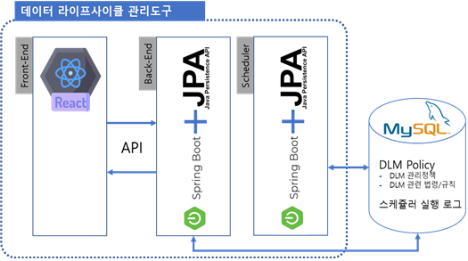
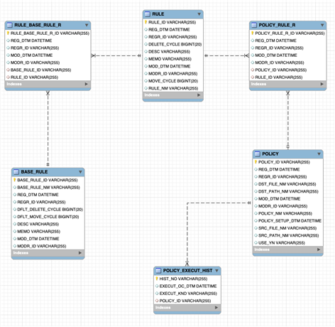

# 데이터레이크 라이프사이클 매니저 및 활용 지원
## 시스템 개요
* 데이터레이크에 저장되는 데이터의 이관.삭제 작업의 자동화를 위한 데이터레이크 라이프사이클 관리 도구 시스템

    <p align="center">
        
    </p>


|구분|역할|
|:--:|:---|
|Front-End| ⸰ 웹 페이지의 보이는 화면을 처리하는 역할<br>⸰ 엔티티 테이블의 레코드 생성 시 사용자가 입력해야 하는 필드만 입력할 수 있도록 제한<br>⸰ 엔티티 테이블의 제약조건을 1차로 확인|
|Back-End|⸰ 구현된 API로 프론트 레이어에서 사용자가 요청한 것을 처리하는 역할<br>⸰ 프론트 레이어와 데이터베이스를 연결하는 역할<br>⸰ 엔티티 테이블에 대해 CRUD 기능을 제공<br>⸰ 엔티티 테이블의 제약조건을 2차로 확인|
|Scheduler|⸰ 매일 특정 시간(0시0분1초)에 정책 엔티티와 규칙 엔티티를 조회하여 데이터 레이크의 파일의 이관·폐기 작업을 실행<br>⸰ 이관·폐기 작업 시 해당 작업 기록을 데이터베이스에 저장|
|Database|⸰ 엔티티, 릴레이션, 히스토리 테이블을 저장하고 관리하는 역할|

## 데이터레이크 라이프사이클 매니저 Front-End 실행
1. requirements
    * NodeJS 설치(최신버전 권장)
	* NPM or YARN 설치(최신버전 권장)
	* Nginx 설치
2. 환경설정 수정 및 배포 스크립트 실행
    1. 디렉토리 구성
        * config : 리액트 프레임워크 설정 디렉토리
        * .env : 나이파이 설정 파일
        * nginx-nifi-monitor-app-config.conf : nginx와 리액트 프레임워크를 연결하는 설정파일
        * package.json, package-lock.json, yarn.lock : 리액트 프레임워크 의존성 관리 파일
        * public : 리액트 관련 프레임워크
        * react-deploy.sh : 전체 실행 명령어가 담긴 배포 스크립트 파일
        * scripts, src : 리액트 프레임워크 소스코드 파일
    2. .env 파일 설정 – 프로젝트 환경 설정
        >vi .env
        * API_URL : 모니터링 서비스에서 사용하는 Back-End 서비스 API의 URL
        * API_PORT : API의 포트번호, 반드시 콜론(:)으로 시작해야 함
    3. nginx 파일 설정
        >vi nginx-nifi-monitor-app-config.conf
        ```
        server {
            listen       18000;
            server_name  localhost;

            #charset koi8-r;
            #access_log  /var/log/nginx/host.access.log  main;

            location / {
                root   /usr/share/nginx/html/scity-dlm-reactjs;
                index  index.html index.htm;
                try_files $uri $uri/ /index.html;
                expires -1;
            }

            #error_page  404              /404.html;

            # redirect server error pages to the static page /50x.html
            #
            error_page   500 502 503 504  /50x.html;
            location = /50x.html {
                root   /usr/share/nginx/html;
            }

            # proxy the PHP scripts to Apache listening on 127.0.0.1:80
            #
            #location ~ \.php$ {
            #    proxy_pass   http://127.0.0.1;
            #}

            # pass the PHP scripts to FastCGI server listening on 127.0.0.1:9000
            #
            #location ~ \.php$ {
            #    root           html;
            #    fastcgi_pass   127.0.0.1:9000;
            #    fastcgi_index  index.php;
            #    fastcgi_param  SCRIPT_FILENAME  /scripts$fastcgi_script_name;
            #    include        fastcgi_params;
            #}

            # deny access to .htaccess files, if Apache's document root
            # concurs with nginx's one
            #
            #location ~ /\.ht {
            #    deny  all;
            #}
        ```
        * Front-End의 실행 포트를 변경하고 싶을경우 “listen 18000”에서 원하는 포트번호로 변경
    4. 배포 스크립트 파일
        ```
        #!/bin/bash

        # shellcheck disable=SC2034
        ROOT_DIR=/usr/share/nginx/html
        APP_DIR=scity-dlm-reactjs
        NGINX_FILE=nginx-scity-react-app-config.conf
        echo "> Starting..."
        chmod +x ./env.sh && ./env.sh && cp env-config.js ./public/
        echo "> Installing the dependencies"
        if [ -d "build" ]
        then
                rm -rf build/
        fi
        npm install
        sleep 2
        echo "> Building the project"
        yarn build
        sleep 2
        if [ -d $ROOT_DIR/$APP_DIR ]
        then
            echo "Directory $ROOT_DIR/$APP_DIR"
            sudo rm -rf $ROOT_DIR/$APP_DIR/*
        else
            echo "Creating Directory $APP_DIR"
            sudo mkdir $ROOT_DIR/$APP_DIR
        fi
        sudo cp -r build/* $ROOT_DIR/$APP_DIR/
        #NGINX Version 1.17.7
        sudo cp $NGINX_FILE /etc/nginx/conf.d/
        echo "> Restarting NGINX Server"
        sudo systemctl restart nginx
        sleep 1
        echo ">>> DONE!"
        ```
        * 설정파일과 소스파일을 빌드한 뒤 실행하는 과정
        * env.sh 파일 및 nginx까지 자동으로 실행
        * ROOT_DIR : nginx와 연동을 위해 지정된 디렉토리
        * APP_DIR : nginx-scity-react-app-config.conf 파일의 location { root 의 /usr/share/nginx/html/{scity-dlm-reactjs}; } 값의 {scity-dlm-reactjs}와 동일
        * NGINX_FILE : 배포 디렉토리 내의 nginx 설정파일인 nginx-scity-react-app-config.conf의 이름과 동일
        * 나이파이정보 변경 후 실행 시 .env 파일 변경 후 react-deploy.sh 파일 실행
        * 실행 명령어
            >./react-deploy.sh

## 데이터레이크 라이프사이클 매니저 Back-End 실행
1. requirements
    * JDK 8 버전 이상 설치
    * 18009 포트 사용 가능
    * Apache Maven 3.3.1 이상 설치

2. 환경설정 수정 및 배포 스크립트 실행
    1. crud 디렉토리 파일 구성
        * application-real-db.properties : 데이터베이스 ip, schema, user, password 등 설정
        * datalifecycle-crud-0.0.1-SNAPSHOT.jar : 소스파일을 패키징한 실행 파일
        * deploy.sh : 전체 실행 명령어가 담긴 배포 스크립트 파일
        * logs : 로그파일을 포함하는 디렉토리
        * smartcity-dlm-crud : 데이터라이프사이클 백엔드 프로젝트 소스코드
    2. DB설정 파일
        * spring.datasource.url : 데이터베이스의 ip 및 schema 설정 
        * spring.datasource.username : 데이터베이스 유저이름
        * spring.datasource.password : 데이터베이스 비밀번호
        * spring.datasource.driver-class-name : jdbc 연결 드라이버
    3. 배포 스크립트 파일
        ```
        #!/bin/bash

        dt=$(date '+%Y%m%d')
        dd=$(date '+%d')
        yymm=$(date '+%Y%m')

        REPOSITORY=/home/cbnu/deploy/dlm/crud
        PROJECT_NAME=smartcity-dlm-crud
        SERVICE_NAME=datalifecycle-crud

        cd $REPOSITORY/$PROJECT_NAME/
        echo "> 프로젝트 Build 시작"
        mvn clean package

        echo "> crud 디렉토리로 이동"
        cd $REPOSITORY
        echo "> Build 파일 복사"

        cp $REPOSITORY/$PROJECT_NAME/target/*.jar $REPOSITORY/
        echo "> 현재 구동중인 애플리케이션 pid 확인"
        CURRENT_PID=$(pgrep -f ${SERVICE_NAME}*.jar)
        echo "> 현재 구동중인 애플리케이션 pid: $CURRENT_PID"

        if [ -z "$CURRENT_PID" ]; then
            echo "> 현재 구동 중인 애플리케이션이 없으므로 종료하지 않습니다."
        else
            echo "> kill -15 $CURRENT_PID"
                kill -15 $CURRENT_PID
                sleep 5
        fi

        echo "> 새 애플리케이션 배포"
        JAR_NAME=$(ls -tr $REPOSITORY/ | grep *.jar | tail –n 1)

        nohup java -jar \
        -Dspring.config.location=classpath:/application.properties,classpath:/application-real.properties,$REPOSITORY/application-real-db.properties $REPOSITORY/$JAR_NAME > $REPOSITORY/logs/${dt}_${SERVICE_NAME}.log 2>&1 &
        ```
        * 소스파일인 smartcity-dlm-crud를 Maven을 이용하여 빌드한 뒤 실행하는 과정
        * 프로세스가 실행 중이면 프로세스를 종료한 뒤 실행
        * 로그파일은 logs 디렉토리에 실행한 “날짜_datalifecycle-crud.log” 이름으로 생성
        * 다시 배포 스크립트 파일이 실행될 때까지 생성된 로그파일에 로그가 기록되며, 배포스크립트 파일을 다시 실행할 시 새로운 로그파일이 생성됨
        * 다른 디렉토리위치 혹은 다른 서버에서 다운로드 및 빌드 시 “REPOSITORY” 변수를 해당 디렉토리 위치에 맞게 변경해야 함
        * DB정보 변경 후 실행 시 application-real-db.properties 파일 변경 후 deploy.sh 파일 실행
        * 실행 명령어
            >./deploy.sh

## Scheduler 실행
1. requirements
    * JDK 8 버전 이상 설치
    * 18009 포트 사용 가능
    * Apache Maven 3.3.1 이상 설치

2. 환경설정 수정 및 배포 스크립트 실행
    1. 디렉토리 파일 구성
        * application-real-db.properties : 데이터베이스 ip, schema, user, password 등 설정
        * datalifecycle-scheduler-0.0.1-SNAPSHOT.jar : 소스파일을 패키징한 실행 파일
        * deploy.sh : 전체 실행 명령어가 담긴 배포 스크립트 파일
        * logs : 로그파일을 포함하는 디렉토리
        * smartcity-dlm-scheduler : 데이터라이프사이클 백엔드 프로젝트 소스코드
    2. DB 설정 파일
        * spring.datasource.url : 데이터베이스의 ip 및 schema 설정 
        * spring.datasource.username : 데이터베이스 유저이름
        * spring.datasource.password : 데이터베이스 비밀번호
        * spring.datasource.driver-class-name : jdbc 연결 드라이버
    3. 배포 스크립트 파일
        ```
        #!/bin/bash

        dt=$(date '+%Y%m%d')
        dd=$(date '+%d')
        yymm=$(date '+%Y%m')

        REPOSITORY=/home/cbnu/deploy/dlm/scheduler
        PROJECT_NAME=smartcity-dlm-scheduler
        SERVICE_NAME=datalifecycle-scheduler

        cd $REPOSITORY/$PROJECT_NAME/

        echo "> 프로젝트 Build 시작"

        mvn clean package

        echo "> crud 디렉토리로 이동"

        cd $REPOSITORY

        echo "> Build 파일 복사"

        cp $REPOSITORY/$PROJECT_NAME/target/*.jar $REPOSITORY/

        echo "> 현재 구동중인 애플리케이션 pid 확인"

        CURRENT_PID=$(pgrep -f ${SERVICE_NAME}*.jar)

        echo "> 현재 구동중인 애플리케이션 pid: $CURRENT_PID"

        if [ -z "$CURRENT_PID" ]; then
            echo "> 현재 구동 중인 애플리케이션이 없으므로 종료하지 않습니다."
        else
            echo "> kill -15 $CURRENT_PID"
                kill -15 $CURRENT_PID
                sleep 5
        fi

        echo "> 새 애플리케이션 배포"
        JAR_NAME=$(ls -tr $REPOSITORY/ | grep *.jar | tail -n 1)
        echo "> JAR Name: $JAR_NAME“
        nohup java -jar \
            -Dspring.config.location=classpath:/application.yml,$REPOSITORY/application-real-db.properties $REPOSITORY/$JAR_NAME > $REPOSITORY/logs/${dt}_${SERVICE_NAME}.log 2>&1 &
        ```
        * 소스파일인 smartcity-dlm-scheduler를 Maven을 이용하여 빌드한 뒤 실행하는 과정
        * 프로세스가 실행 중이면 프로세스를 종료한 뒤 실행
        * 로그파일은 logs 디렉토리에 실행한 “날짜_datalifecycle-scheduler.log” 이름으로 생성
        * 다시 배포 스크립트 파일이 실행될 때까지 생성된 로그파일에 로그가 기록되며, 배포스크립트 파일을 다시 실행할 시 새로운 로그파일이 생성됨
        * 다른 디렉토리위치 혹은 다른 서버에서 다운로드 및 빌드 시 “REPOSITORY” 변수를 해당 디렉토리 위치에 맞게 변경해야 함
        * DB정보 변경 후 실행 시 application-real-db.properties 파일 변경 후 deploy.sh 파일 실행
        * 실행 명령어
            >./deploy.sh
## Database Table Schema
1. ERD
    * 데이터레이크 라이프사이클 관리 도구를 위해 생성한 테이블은 기본 엔티티(entity) 테이블 3개, Relation 테이블 2개, History 테이블 1개이다.
        <p align="center">
            
        </p>

2. BASE_RULE(기본규칙) 테이블
    * 기본규칙 테이블은 규칙의 근거가 되는 법률이나 내부 규정 등에 대한 정보를 저장하는 테이블이다.
        |컬럼명(Eng)|컬럼명(Kor)|데이터 타입|옵션|
        |---|---|---|---|   
        |BASE_RULE_ID|기본규칙ID|VARCHAR(30)|PK|
        |BASE_RULE_NM|기본규칙명|VARCHAR(50)|Not Null,Unique|
        |DFLT_MOVE_CYCLE|디폴트이관주기|INT|Not Null|
        |DFLT_DELETE_CYCLE|디폴트삭제주기|INT|Not Null|
        |DESC|세부내용|TEXT||
        |MEMO|메모|TEXT||
        |REG_DTM|등록일시|DATETIME|Not Null|
        |REGR_ID|등록자ID|VARCHAR(50)|Not Null|
        |MOD_DTM|수정일시|DATETIME|Not Null|

3. RULE(규칙) 테이블
    * 규칙 테이블은 기본규칙을 참고하여 데이터 레이크의 파일이나 디렉토리에 적용할 규칙을 저장하는 테이블이다.
        |컬럼명(Eng)|컬럼명(Kor)|데이터 타입|옵션|
        |---|---|---|---|   
        |RULE_NM|규칙명|VARCHAR(50)|Not Null,Unique|
        |MOVE_CYCLE|이관주기|INT|Not Null|
        |DELETE_CYCLE|삭제주기|INT|Not Null|
        |DESC|세부내용|TEXT||
        |MEMO|메모|TEXT||
        |REG_DTM|등록일시|DATETIME|Not Null|
        |REGR_ID|등록자ID|VARCHAR(50)|Not Null|
        |MOD_DTM|수정일시|DATETIME|Not Null|
        |MODR_ID|수정자ID|VARCHAR(50)|Not Null|

4. POLICY(정책) 테이블
    * 정책 테이블은 규칙 테이블에 저장된 규칙을 적용하여 실제 데이터 레이크의 파일 혹은 디렉토리에 적용할 정책을 저장하는 테이블이다.
        |컬럼명(Eng)|컬럼명(Kor)|데이터 타입|옵션|
        |---|---|---|---|      
        |POLICY_ID|규칙ID|VARCHAR(30)|PK|
        |POLICY_NM|규칙명|VARCHAR(50)|Not Null,Unique|
        |SRC_PATH_NM|소스경로명|VARCHAR(255)|Not Null|
        |SRC_FILE_NM|소스파일명|VARCHAR(255)|Unique|
        |DST_PATH_NM|목적경로명|VARCHAR(255)|Not Null|
        |DST_FILE_NM|목적파일명|VARCHAR(255)|Unique|
        |USE_YN|사용여부|VARCHAR(1)|Not Null|
        |POLICY_SETUP_DTM|정책설정일시|DATETIME|Not Null|
        |DESC|세부내용|TEXT||
        |MEMO|메모|TEXT||
        |REG_DTM|등록일시|DATETIME|Not Null|
        |REGR_ID|등록자ID|VARCHAR(50)|Not Null|
        |MOD_DTM|수정일시|DATETIME|Not Null|
        |MODR_ID|수정자ID|VARCHAR(50)|Not Null|


5. POLICY_EXECUT_HOST(정책이행이력) 테이블
    * 정책이 지정된 데이터 레이크의 파일이 이관되거나 삭제될 때 실행된 이력을 저장하는 테이블이다. POLICY(정책) 테이블의 정책ID를 참조한다.
        |컬럼명(Eng)|컬럼명(Kor)|데이터 타입|옵션|
        |---|---|---|---|       
        |HIST_NO|이력ID|VARCHAR(30)|PK|
        |EXECUT_OC_DTM        |이행발생일시        |DATETIME        |Not Null,Unique|
        |EXECUT_KND        |이행종류        |TINYINT(1)        |Not Null|
        |POLICY_ID        |정책ID        |INT        |FK|

6. RULE_BASE_RULE_R(규칙별기본규칙관계) 테이블
    * 기본규칙 테이블과 규칙 테이블의 관계를 저장하는 릴레이션 테이블로 기본규칙 테이블과 규칙 테이블은 다대다 관계이다.
        |컬럼명(Eng)|컬럼명(Kor)|데이터 타입|옵션|
        |---|---|---|---|
        |RULE_BASE_RULE_R_ID|규칙별기본규칙ID|VARCHAR(32)|PK|
        |BASE_RULE_ID|기본규칙ID|VARCHAR(30)|FK|
        |RULE_ID|규칙ID|VARCHAR(50)|FK|
        |REG_DTM|등록일시|DATETIME|Not Null|
        |REGR_ID|등록자ID|VARCHAR(50)|Not Null|
        |MOD_DTM|수정일시|DATETIME|Not Null|
        |MODR_ID|수정자ID|VARCHAR(50)|Not Null|


7. POLICY_RULE_R(정책별규칙관계) 테이블
    * 규칙 테이블과 정책 테이블의 관계를 저장하는 릴레이션 테이블로 규칙 테이블과 정책 테이블은 다대다 관계이다.
    
        |컬럼명(Eng)|컬럼명(Kor)|데이터 타입|옵션|
        |---|---|---|---|
        |POLICY_RULE_R_ID|정책별규칙ID|VARCHAR(32)|PK|
        |RULE_ID|규칙ID|VARCHAR(30)|FK|
        |POLICY_ID|정책ID|VARCHAR(50)|FK|
        |REG_DTM|등록일시|DATETIME|Not Null|
        |REGR_ID|등록자ID|VARCHAR(50)|Not Null|
        |MOD_DTM|수정일시|DATETIME|Not Null|
        |MODR_ID|수정자ID|VARCHAR(50)|Not Null|
