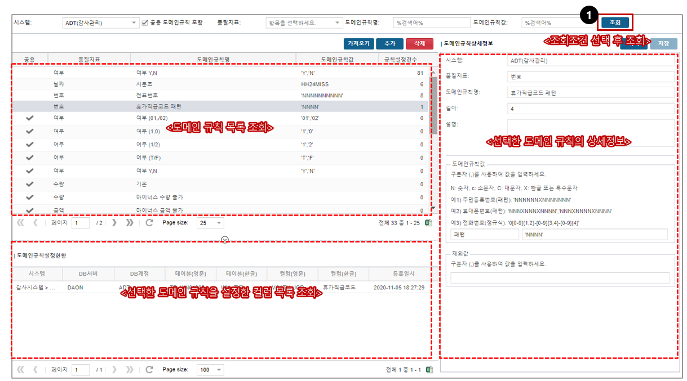

# 데이터레이크 품질관리 SW 적용
## 목차
* 데이터품질관리 개요
    * '데이터품질관리'란?
    * 데이터품질관리 활동 목표
    * 공통기준-DQI (데이터품질지표)
    * 중요기준-CTQ (핵심품질항목) 
    * 분석-데이터 프로파일링-규칙발견
    * 규칙-진단규칙 유형-3가지
* 역할과 책임
* 데이터품질관리 프로세스

## 1. 데이터품질관리 개요
### 1.1 '데이터품질관리'란?
* 정의
    * 조직이 운영하는 정보시스템과 데이터베이스를 활용하는 이용자의 기대를 만족시키기 위해 지속적으로 수행하는 데이터 관리활동
    * 운영서버에 배포한 어플리케이션에서 발생한 데이터가 설계한대로 저장되어 있는지를 확인하기 위한 활동을 말한다.

* 목적
    * 품질을 목표수준으로 개선하고, 유지하여 오류 데이터 발생을 예방하는데 목적이 있음

* 대상
    * 기본적으로 데이터포털에서 관리하는 시스템은 품질진단 대상
    * 패키지, 폐기 대상, 기타 사유가 있을 경우, 전사 품질담당자와 협의하여 대상에서 제외할 수 있음

### 1.2 데이터품질관리 활동 목표
* 데이터 품질관리 활동 : 품질을 목표수준으로 개선하고, 유지하는 모든 활동
    

        
    

| 단계  | 설명                                                                                                       |
| :---: | :--------------------------------------------------------------------------------------------------------- |
| 정의  | 품질점검대상, 품질지표(DQI), 중요정보항목(CTQ), 진단규칙 등  데이터품질관리 활동의 기준을 정의하는 단계 |
| 측정  | 정의된 대상과 정의된 진단규칙을 기준으로 규칙에 위배되는 오류데이터를 추출하는 단계                        |
| 분석  | 추출된 오류데이터를 통해 오류현상, 오류원인, 영향도 등을 파악하는 단계                                     |
| 개선  | 오류항목의 개선계획을 수립하고, 오류데이터와 원인을 개선하는 단계                                          |
| 통제  | 개선에 대한 평가와 데이터품질관리 절차 전체를 통제하는 단계                                                |

### 1.3 공통기준-DQI (데이터품질지표)
* 정의
    * DQI(Data Quality Indicator, 데이터 품질기준)이란 데이터의 품질 수준을 평가하는 기준으로 데이터의 정확성 및 품질 확보를 위하여 지속적으로 관리되어야 할 측정 기준을 의미함

* 목적
    * 정의된 DQI는 CTQ(Critical to Quality, 핵심 품질 항목)에 대한 컬럼별 진단규칙을 적용하기 위한 기준이 됨

* 선정기준
    * 일반적으로 공공데이터 수준평가/DQC-V/타사 사례 분석과 기업의 현황 분석을 통해 DQI를 정의함. 일반적인 활용 예시를 작성함

    

        
    

|       품질기준       | 정의                                                                            |
| :------------------: | :------------------------------------------------------------------------------ |
| 완전성(Completeness) | 필수 항목에 누락이 없어야 함                                                    |
|   유효성(Validity)   | 데이터 항목은 정해진 데이터 유효 범위 및 도메인을 충족하여야 함                 |
|   정확성(Accuracy)   | 실세계에 존재하는 객체의 표현 값이 정확히 반영이 되어야 한다는 것을 의미        |
|  유일성(Uniqueness)  | 데이터 항목은 유일하여야 하며 중복되어서는 안됨                                 |
| 일관성(Consistency)  | 데이터가 지켜야 할 구조, 값 표현되는 형태가 일관 되게 정의되고 서로 일치해야 함 |

### 1.4 중요기준-CTQ (핵심품질항목) 
* 정의
    * CTQ(Critical to Quality, 핵심 품질 항목)란 6Sigma(6σ)에서 유래한 용어로서, 데이터 품질관리 관점으로는 데이터의 신뢰도가 고객, 프로세스 및 시장 환경 등 기업 경영에 중요한 영향을 미치는 데이터 품질관리 대상 정보항목을 의미
* 목적
    * 개선 항목의 선택과 집중을 통해 중요하지 않은 데이터 개선 수행의 비용 낭비를 예방 함
    * 주요 엔터티 및 속성을 도출하고 그룹핑하여 CTQ로 정의하고, 도출된 속성별로 DQI를 적용하여 업무 규칙 정의의 기초로 활용함
* 선정기준
    * 데이터 관점의 품질 이슈 조사를 통한 기술적 관점과 현업과의 인터뷰 및 요구사항 분석을 통한 업무적 관점이 있음

|       기준        | 고려사항                                                                                                                                                                  |
| :---------------: | :------------------------------------------------------------------------------------------------------------------------------------------------------------------------ |
|  프로세스영향도   | • 해당 데이터의 업무 프로세스 상 중요성 • 업무 하위 프로세스에 미치는 중요도 • 데이터 변경에 따른 하위 프로세스 변경도 • 데이터 변경에 따른 타시스템 변경 영향도 |
|    시장 영향도    | • 데이터의 법적 리스크 • 정부 규제 영향도 • 경쟁사 현황 및 시장 현황 영향도                                                                                         |
|   재무적 영향도   | • 재무적 관점에서 관리가 필요한 데이터 • 매출/원가 등 각 부서별 상이한 관점에 의해 관리가 필요한 데이터                                                                |
| 최종사용자 영향도 | • 고객 서비스 리스크가 큰 데이터 • 최종 사용자의 의사결정에 중요한 영향력을 갖는 데이터• 마케팅 관점에서 관리가 필요한 데이터                                          |

### 1.5 분석-데이터 프로파일링-규칙발견
* 데이터 프로파일링 : 실제 DB Table의 데이터를 분석하여 값의 패턴, 분포, 현상 등을 파악
    

        
    

### 1.6 규칙-진단규칙 유형-3가지
* 진단규칙 : 오류 데이터를 추출할 수 있는 Rule로서 SQL로 작성
    

        
    

| 진단규칙 유형  | 설명                                                                                                                                    |
| :------------: | :-------------------------------------------------------------------------------------------------------------------------------------- |
|  1. 업무 규칙  | • 복잡한 계산식이나 담당자가 Rule을 직접 작성해야 하는 진단규칙 ※ 검증룰(SQL)을 담당자가 직접 작성해야 함                            |
|  2. 참조 규칙  | • 두 테이블 간에 부모/자식 or 상위/하위의 논리적인 참조관계가 존재하는 경우의 진단규칙 ※ 데이터모델(ERD)의 관계 정보로 일괄등록 가능 |
| 3. 도에인 규칙 | • 날짜, 코드, 유효값 등의 비교적 단순한 진단규칙 ※ 검증룰(SQL)이 솔루션에서 자동으로 생성됨                                          |

## 2. 역할과 책임
|        역할        | 책임                                                                                                                               |
| :----------------: | :--------------------------------------------------------------------------------------------------------------------------------- |
| 시스템 품질 담당자 | • 오류데이터 발생 시, SM담당자에게 원인분석 요청 • 오류개선 조치가 완료되었는지 확인 후 개선완료 Closing                        |
|     SM 담당자      | • 품질관리 대상 테이블/컬럼 등록 • 데이터 프로파일링 • 진단규칙 등록 • 진단규칙 실행 • 오류원인분석 • 오류개선 활동 |

## 3. 데이터품질관리 프로세스
### 3.1 프로파일링

    

### 3.2 도메인규칙 등록
* 시스템별로 검증룰(도메인 규칙)을 미리 등록하여 재사용
    

        
    

### 3.3 도메인규칙 설정
* 등록된 도메인규칙을 컬럼에 지정
    

        
    

* 등록된 코드 테이블에서 코드를 조회하여 지정
    

        
    

### 3.4 관계규칙 설정
* ‘모델관계 가져오기‘ 기능을 사용하여 ERD에서 관계 정보를 가져오기
    

        
    

### 3.5 업무규칙 설정
* 복잡한 수식이나 규칙을 담당자가 직접 SQL로 작성하여 등록
    

        
    

### 3.6 진단작업 등록 및 스케쥴링 
* 데이터 품질 진단 작업의 정기적 실행 및 모니터링
    

        
    

* 작업예약을 설정하여 주기적이고 반복적으로 품질 측정
    

        
    

* 실행할 검증룰(SQL)을 확인하고 범위 등을 조정
    

        
    

### 3.7 오류원인 분석
* 데이터 품질 진단 결과, 오류 데이터에 대한 원인 분석
    

        
    

### 3.8 오류원인 분석 요청
* SM 담당자에게 오류데이터에 대한 원인 분석 요청(ITSM 연계)
    

        
    

### 3.9 영향도 정보 연계 확인
* 원인 분석을 위해 영향도분석 정보를 연계하여 확인 가능
    

        
    

### 3.10 데이터모델(ERD) 정보 연계 확인
* 원인 분석을 위해 데이터모델(ERD)를 연계하여 확인 가능
    

        
    

### 3.11 오류데이터 추이 확인
* 지속적으로 발생하는 오류의 경우, 발생 추이를 확인
    

        
    

### 3.12 진단작업 등록 및 스케쥴링
* 오류데이터에 대한 개선과제를 관리하고(ITSM 연계), 조치 수행 후 결과 등록
    

        
    

### 3.13 오류원인 분석 요청 건 접수
* 원인 분석을 위해 담당자는 요청된 건에 대해 '접수'를 통해 원인 분석 시작
    

        
    

### 3.14 원인분석 내용 및 개선계획 작성
* 원인 분석 결과와 향후 개선계획을 작성, 필요시 파일 첨부
    

        
    

### 3.15 개선완료 Closing
* 시스템 품질담당자는 개선 결과를 확인 후 '개선완료'로 해당 진단규칙의 개선활동 Closing
    

        
    

